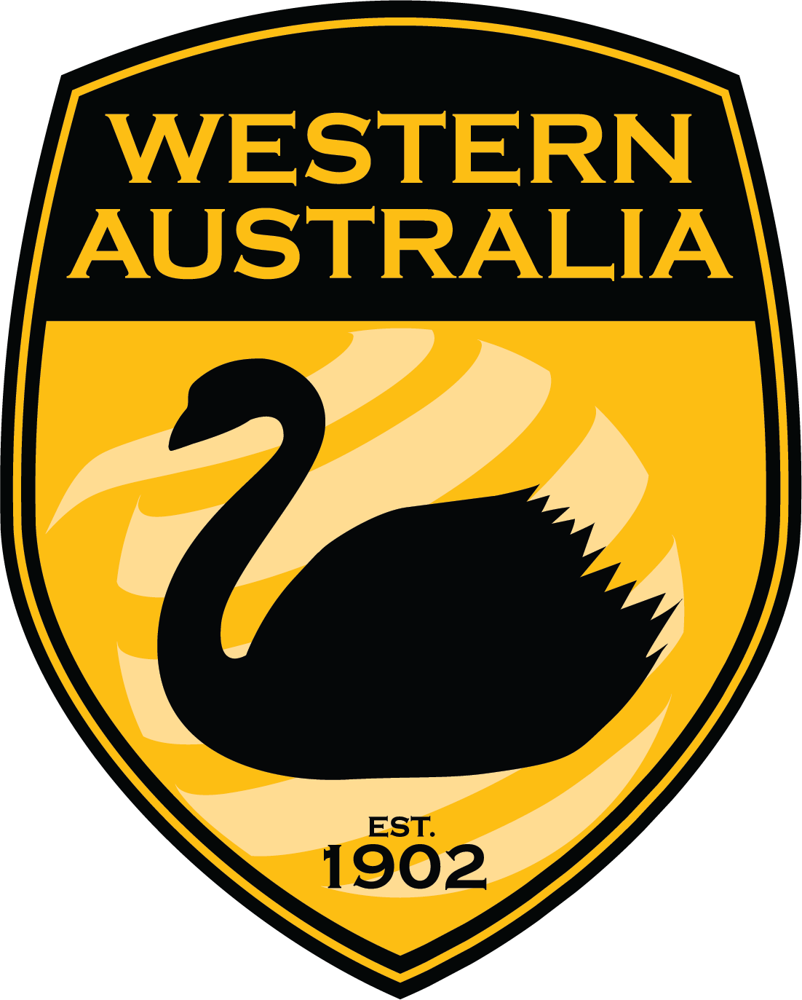

## Introduction to EC6Net

The EC6Net is a mutual assistance net for Amateur Radio Operators in VK6.

Our aim is to build a community of trained operators who will come together in times of need to assist each other and our communities.

The sharing of information during an emergency if of utmost importance.

The tools for sharing information a many an varied in Amateur Radio and learning and training are an important part of being a member of the EC6Net community.

## Getting Involved

Email [vk6dev@gmail.com](mailto:vk6dev@gmail.com) for further information. 

Participate in [our nets](/docs/get-involved/nets)

Read the Documentation

## Traffic

What information will we need to pass between operators? Do we need any standard formats?

- Weather
- Road Conditions
- Wellbeing / Welfare
- Station Status
- Assitance Request
- Forward Message ??
